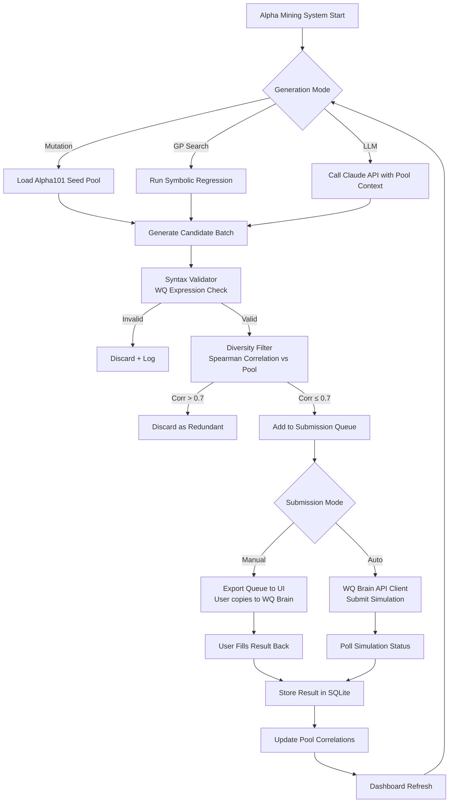
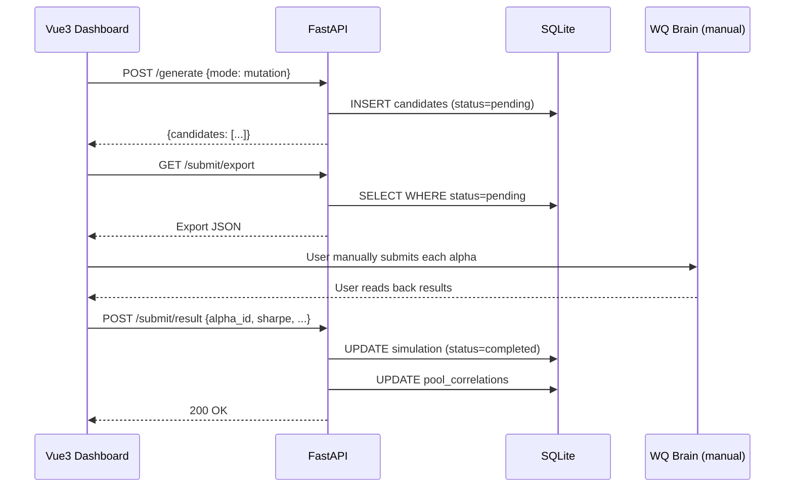

# Software Design Document: Alpha Miner

> Iterative SDD — Each phase builds on the previous one. Implement in order.
> Last updated: 2026-03-25

---

## Table of Contents

1. [Project Overview](#1-project-overview)
   - [1.1 Goals & Constraints](#11-goals--constraints)
   - [1.2 System Architecture Overview](#12-system-architecture-overview)
   - [1.3 Overall Execution Flow](#13-overall-execution-flow)
2. [Phase 1: Core Infrastructure & Alpha Seed Pool](#2-phase-1-core-infrastructure--alpha-seed-pool)
3. [Phase 2: WQ Brain Interface & Manual Queue](#3-phase-2-wq-brain-interface--manual-queue)
4. [Phase 3: Diversity Filter & Local Proxy Data](#4-phase-3-diversity-filter--local-proxy-data)
5. [Phase 4: LLM Generator (Claude API)](#5-phase-4-llm-generator-claude-api)
6. [Phase 5: GP Searcher](#6-phase-5-gp-searcher)
7. [Phase 6: Vue3 Dashboard](#7-phase-6-vue3-dashboard)
8. [Database Schema](#8-database-schema)
9. [API Reference](#9-api-reference)
10. [Risks & Notes](#10-risks--notes)

---

## 1. Project Overview

### 1.1 Goals & Constraints

**Goal**: Build a modular alpha mining system that generates, filters, and tracks formulaic alpha expressions compatible with the WorldQuant BRAIN platform, with IQC competition performance as the primary optimization target.

**Primary objectives (in priority order)**:
1. Maximize the quality and diversity of the submitted alpha pool on WQ Brain (IQC scoring)
2. Provide a clean engineering portfolio artifact demonstrating full-stack + AI integration
3. Maintain a reproducible research workflow for iterative alpha discovery

**Hard constraints**:
- Hardware: NVIDIA GTX 1650 Ti (4GB VRAM), 16GB RAM — no GPU-intensive training
- Solo developer, 3-month timeline
- WQ Brain is the **only** backtesting engine; no local historical simulation
- Python 3.11 (not 3.13 — ecosystem compatibility with gplearn/sklearn)
- No paid data sources; yfinance for local proxy data

**Out of scope**:
- Live trading execution
- Portfolio optimization beyond alpha pool management
- Markets other than USA Top3000 (WQ Brain default)
- Alpha decay modelling (deferred to future work)

---

### 1.2 System Architecture Overview

```
┌─────────────────────────────────────────────────────────────────┐
│                        Vue3 + Vite (Frontend)                    │
│                                                                  │
│   Alpha Editor │ Pool Dashboard │ Submission Queue │ Analytics  │
└──────────────────────────────┬──────────────────────────────────┘
                                │ HTTP / REST
┌──────────────────────────────▼──────────────────────────────────┐
│                         FastAPI (Backend)                        │
│                                                                  │
│  Routers: /alphas  /generate  /filter  /submit  /pool  /results │
└──────┬──────────────────┬───────────────────┬────────────────────┘
       │                  │                   │
┌──────▼──────┐  ┌────────▼────────┐  ┌───────▼──────────────────┐
│   Alpha     │  │    Diversity    │  │    WQ Brain Interface     │
│  Generation │  │     Filter      │  │  (Manual Queue / Auto)   │
│   Engine    │  │  (Spearman IC)  │  └──────────────────────────┘
│             │  └────────┬────────┘
│ - Seed Pool │           │
│ - Mutator   │  ┌────────▼────────┐
│ - GP Search │  │  Proxy Data     │
│ - LLM Gen   │  │  (yfinance      │
└──────┬──────┘  │   S&P500)       │
       │         └─────────────────┘
       │
┌──────▼──────────────────────────────────────────────────────────┐
│                        SQLite (Local DB)                         │
│  alphas │ simulations │ pool_correlations │ proxy_prices │ runs  │
└─────────────────────────────────────────────────────────────────┘
```

**Key design principles**:
- **WQ Brain as oracle**: All real backtesting deferred to WQ Brain; local computation is for filtering only
- **Diversity-first**: Alpha pool correlation management is a first-class concern, not an afterthought
- **Phase-gated development**: Each phase is independently testable and delivers standalone value
- **Interface segregation**: WQ Brain interaction is isolated behind an interface so auto/manual modes are swappable

---

### 1.3 Overall Execution Flow



---

## 2. Phase 1: Core Infrastructure & Alpha Seed Pool

### 2.1 Requirements

- Set up FastAPI application with modular router structure
- Define all SQLite schemas and ORM models (SQLAlchemy)
- Implement Alpha101 seed pool as hardcoded Python definitions
- Implement `AlphaCandidate` data model with full metadata
- Implement `TemplateMutator` with at minimum: lookback variation, operator swaps, rank wrapping

### 2.2 Directory Structure

```
backend/
├── main.py                  # FastAPI app entry point
├── config.py                # Settings (env-based via pydantic-settings)
├── database.py              # SQLAlchemy engine + session factory
├── models/
│   ├── alpha.py             # Alpha ORM model
│   ├── simulation.py        # Simulation ORM model
│   └── correlation.py       # PoolCorrelation ORM model
├── schemas/
│   ├── alpha.py             # Pydantic request/response schemas
│   └── simulation.py
├── api/
│   ├── alphas.py            # CRUD endpoints for alphas
│   ├── generate.py          # Generation trigger endpoints
│   ├── submit.py            # Submission queue endpoints
│   └── pool.py              # Pool health endpoints
├── core/
│   ├── seed_pool.py         # Alpha101 definitions
│   ├── mutator.py           # TemplateMutator
│   ├── gp_searcher.py       # GP-based search (Phase 5)
│   ├── llm_generator.py     # Claude API integration (Phase 4)
│   └── expression_validator.py  # WQ syntax checker
├── services/
│   ├── diversity_filter.py  # Correlation-based filtering
│   ├── proxy_data.py        # yfinance data manager
│   └── wq_interface.py      # WQ Brain client (manual + auto)
└── db/
    └── migrations/          # Alembic migration scripts
```

### 2.3 Alpha Candidate Data Model

```python
@dataclass
class AlphaCandidate:
    id: str                    # SHA256 hash of (expression + config)
    expression: str            # WQ Fast Expression string
    universe: str              # e.g. "TOP3000"
    region: str                # e.g. "USA"
    delay: int                 # 0 or 1
    decay: int                 # 0–32
    neutralization: str        # "none"|"market"|"sector"|"industry"|"subindustry"
    truncation: float          # typically 0.01–0.1
    pasteurization: str        # "on"|"off"
    nan_handling: str          # "on"|"off"
    source: AlphaSource        # Enum: SEED | MUTATION | GP | LLM | MANUAL
    parent_id: str | None      # For mutations: reference to parent alpha
    rationale: str | None      # LLM-generated explanation
    created_at: datetime
```

### 2.4 TemplateMutator

```python
class TemplateMutator:
    LOOKBACK_VARIANTS = [5, 10, 20, 40, 60]
    OPERATOR_SWAPS = {
        "ts_mean": ["ts_median", "ts_max", "ts_min", "ts_std"],
        "rank":    ["zscore", "scale"],
        "ts_corr": ["ts_covariance"],
    }

    def mutate_lookback(self, alpha: AlphaCandidate) -> list[AlphaCandidate]:
        """Replace numeric window arguments with variants."""
        ...

    def mutate_operator(self, alpha: AlphaCandidate) -> list[AlphaCandidate]:
        """Swap operators with semantically similar alternatives."""
        ...

    def mutate_rank_wrap(self, alpha: AlphaCandidate) -> list[AlphaCandidate]:
        """Wrap inner expressions with rank() or zscore()."""
        ...

    def mutate_config(self, alpha: AlphaCandidate) -> list[AlphaCandidate]:
        """Vary neutralization, decay, truncation settings."""
        ...

    def mutate_all(self, alpha: AlphaCandidate) -> list[AlphaCandidate]:
        """Apply all mutation strategies; deduplicate by expression hash."""
        ...
```

### 2.5 Expression Validator

All generated expressions must be validated before entering the queue:

| Check | Method |
|-------|--------|
| Balanced parentheses | String parsing |
| Operator name whitelist | Set lookup against WQ operator list |
| Numeric argument ranges | Regex + range check |
| No Python-only syntax | Keyword blacklist |

Invalid expressions are logged with reason and discarded. They do **not** raise exceptions.

### 2.6 Phase 1 KPI

> ✅ The system can generate a batch of mutation candidates from Alpha101 seeds, validate them, and display them in a table via a CLI script or basic API call.

---

## 3. Phase 2: WQ Brain Interface & Manual Queue

### 3.1 Requirements

- Implement `WQBrainInterface` as an abstract base class
- Implement `ManualQueueClient` (concrete): exports pending alphas as structured JSON/CSV for human copy-paste
- Implement `AutoAPIClient` (concrete, optional): wraps unofficial WQ Brain API
- Implement result import: user pastes back Sharpe, Fitness, Returns, Turnover from WQ Brain UI
- All WQ interactions logged to `simulations` table

### 3.2 Interface Design

```python
from abc import ABC, abstractmethod

class WQBrainInterface(ABC):
    @abstractmethod
    async def submit(self, alpha: AlphaCandidate) -> str:
        """Submit alpha for simulation. Returns simulation_id."""
        ...

    @abstractmethod
    async def get_result(self, simulation_id: str) -> SimulationResult | None:
        """Poll or retrieve completed simulation result."""
        ...

class ManualQueueClient(WQBrainInterface):
    async def submit(self, alpha: AlphaCandidate) -> str:
        """Write alpha to pending queue in DB. Returns queue entry ID."""
        ...

    async def get_result(self, simulation_id: str) -> SimulationResult | None:
        """Read from DB; populated by user via import endpoint."""
        ...

    def export_pending(self, format: str = "json") -> list[dict]:
        """Export pending alphas formatted for WQ Brain UI fields."""
        ...

class AutoAPIClient(WQBrainInterface):
    """Uses session-based unofficial API. Fragile; treat as best-effort."""
    async def submit(self, alpha: AlphaCandidate) -> str: ...
    async def get_result(self, simulation_id: str) -> SimulationResult | None: ...
```

### 3.3 Manual Queue Export Format

Each exported entry maps directly to WQ Brain UI fields:

```json
{
  "alpha_id": "a3f9...",
  "expression": "-rank(ts_delta(close, 5))",
  "settings": {
    "region": "USA",
    "universe": "TOP3000",
    "delay": 1,
    "decay": 4,
    "neutralization": "Subindustry",
    "truncation": 0.08,
    "pasteurization": "Off",
    "nan_handling": "Off"
  }
}
```

### 3.4 Result Import Endpoint

```
POST /api/submit/result
Body: {
  "alpha_id": "a3f9...",
  "sharpe": 1.43,
  "fitness": 1.12,
  "returns": 0.087,
  "turnover": 0.61,
  "passed": true
}
```

### 3.5 Sequence Diagram (Manual Mode)



### 3.6 Phase 2 KPI

> ✅ User can export a batch of pending alphas from the dashboard, submit them manually to WQ Brain, paste results back, and see the pool update in real time.

---

## 4. Phase 3: Diversity Filter & Local Proxy Data

### 4.1 Requirements

- Download and maintain a local proxy dataset using yfinance (S&P 500 constituents, 2 years of OHLCV)
- Compute cross-sectional factor values for each alpha expression on local data
- Compute Spearman rank correlation between candidate alpha values and each existing pool member
- Reject candidates with `max(correlation) > DIVERSITY_THRESHOLD` (default: 0.7)

### 4.2 Proxy Data Manager

```python
class ProxyDataManager:
    SP500_TICKERS_URL = "https://en.wikipedia.org/wiki/List_of_S%26P_500_companies"
    DEFAULT_PERIOD = "2y"

    def update(self) -> None:
        """Fetch latest S&P 500 constituent list and download OHLCV."""
        ...

    def get_panel(self) -> pd.DataFrame:
        """Return MultiIndex DataFrame: (date, ticker) × (open, high, low, close, volume)."""
        ...
```

> ⚠️ **Limitation**: Local proxy covers ~500 stocks vs WQ Brain's 3000. Correlation estimates are approximate. The filter reduces redundancy; it does not guarantee uncorrelated WQ Brain results.

### 4.3 Alpha Expression Evaluator

```python
class AlphaEvaluator:
    SUPPORTED_OPERATORS = {
        "ts_mean", "ts_std", "ts_delta", "ts_rank", "rank",
        "zscore", "scale", "log", "abs", "sign",
        # ... full WQ operator subset that maps to pandas/numpy
    }

    def evaluate(self, expression: str, panel: pd.DataFrame) -> pd.Series:
        """
        Evaluate a WQ Fast Expression on the proxy panel.
        Returns a Series indexed by (date, ticker).
        Raises UnsupportedOperatorError if expression uses unmapped operators.
        """
        ...
```

**Design note**: Not all WQ operators can be locally evaluated (e.g., fundamental data fields). For such alphas, diversity filtering is skipped and the candidate is flagged `filter_skipped=True` in the DB.

### 4.4 Diversity Filter

```python
class DiversityFilter:
    def __init__(self, threshold: float = 0.7):
        self.threshold = threshold

    def should_submit(
        self,
        candidate: AlphaCandidate,
        pool: list[AlphaCandidate],
        evaluator: AlphaEvaluator,
        panel: pd.DataFrame,
    ) -> tuple[bool, float]:
        """
        Returns (should_submit, max_correlation_with_pool).
        If candidate cannot be evaluated locally, returns (True, NaN).
        """
        ...
```

### 4.5 Phase 3 KPI

> ✅ Candidates that are structurally similar to existing pool members are automatically rejected before entering the submission queue, with correlation scores logged.

---

## 5. Phase 4: LLM Generator (Claude API)

### 5.1 Requirements

- Call Claude API to generate novel alpha expressions based on pool context
- System prompt includes: WQ operator reference, current top-10 pool alphas, target diversity requirement
- Response parsed as structured JSON; validated before entering pipeline
- Maintain a `rationale` field per alpha for interpretability

### 5.2 Prompt Architecture

```
System Prompt (static):
  - Role: quantitative finance researcher
  - WQ Fast Expression syntax reference
  - Operator list with descriptions
  - Output format: JSON array of {expression, config, rationale}

User Prompt (dynamic, built per request):
  - Current pool summary: top-10 alphas by Fitness, with their Sharpe/Returns/Turnover
  - Thematic constraint: e.g. "focus on volume-price divergence"
  - Diversity instruction: "avoid logic similar to: [pool expressions]"
  - Quantity: "generate N candidates"
```

### 5.3 LLM Generator Class

```python
class LLMGenerator:
    MODEL = "claude-opus-4-6"  # or sonnet depending on cost/quality tradeoff
    MAX_TOKENS = 2000

    def __init__(self, api_key: str):
        self.client = anthropic.Anthropic(api_key=api_key)

    def generate(
        self,
        pool_context: PoolContext,
        theme: str | None = None,
        n: int = 10,
    ) -> list[AlphaCandidate]:
        """
        Call Claude API and parse response into AlphaCandidates.
        Malformed JSON or invalid expressions are logged and dropped.
        """
        ...

    def _build_system_prompt(self) -> str: ...
    def _build_user_prompt(self, pool_context: PoolContext, theme: str, n: int) -> str: ...
    def _parse_response(self, raw: str) -> list[dict]: ...
```

### 5.4 Pool Context Builder

```python
@dataclass
class PoolContext:
    top_alphas: list[dict]      # Top 10 by Fitness: {expression, sharpe, fitness, returns}
    pool_themes: list[str]      # Inferred categories: ["momentum", "mean-reversion", ...]
    weak_areas: list[str]       # Categories underrepresented in pool
    total_pool_size: int
```

### 5.5 Cost Management

| Parameter | Default | Notes |
|-----------|---------|-------|
| Max calls/day | 20 | Configurable via `config.py` |
| Candidates per call | 10 | Adjust based on API cost budget |
| Model | claude-sonnet-4-6 | Cheaper; Opus only for complex themes |
| Estimated cost/day | ~$0.10–$0.30 | At Sonnet pricing, 20 calls × ~500 tokens |

### 5.6 Phase 4 KPI

> ✅ Given a populated pool of 10+ alphas, the LLM generator produces syntactically valid candidates that pass the expression validator, with at least 50% surviving diversity filtering.

---

## 6. Phase 5: GP Searcher

### 6.1 Requirements

- Use symbolic regression to search the WQ expression space
- Operator set constrained to locally-evaluable WQ operators
- Fitness function: IC (Information Coefficient) computed on proxy data against next-day returns
- CPU-only; no GPU required

### 6.2 GP Configuration

```python
GP_CONFIG = {
    "population_size": 500,
    "generations": 20,
    "tournament_size": 20,
    "p_crossover": 0.7,
    "p_subtree_mutation": 0.1,
    "p_hoist_mutation": 0.05,
    "p_point_mutation": 0.1,
    "max_samples": 0.9,
    "parsimony_coefficient": 0.001,   # Penalise complexity
    "function_set": [
        "add", "sub", "mul", "div",
        "ts_mean_5", "ts_mean_10", "ts_mean_20",
        "ts_std_5", "ts_std_20",
        "ts_delta_1", "ts_delta_5",
        "rank", "zscore",
        "log", "abs", "neg",
    ],
    "metric": "spearman",
}
```

### 6.3 Fitness Function

```python
def ic_fitness(y_pred: np.ndarray, y_true: np.ndarray, sample_weight=None) -> float:
    """
    Information Coefficient: Spearman rank correlation between
    predicted cross-sectional alpha values and next-day returns.
    Higher is better. Returns 0.0 on degenerate predictions.
    """
    if np.std(y_pred) < 1e-8:
        return 0.0
    return spearmanr(y_pred, y_true).correlation
```

### 6.4 Known Limitations

| Limitation | Impact | Mitigation |
|------------|--------|------------|
| Proxy data ≠ WQ data | Local IC ≠ WQ Sharpe | Use IC as filter, not selection criterion |
| Small search space | Misses complex alphas | Combine with LLM generator |
| Overfitting to proxy period | Decay in real backtest | Use 2y data, test on last 6m holdout |
| CPU speed | ~20 min per run | Run overnight; use multiprocessing |

### 6.5 Phase 5 KPI

> ✅ GP searcher completes a 20-generation run in under 30 minutes on CPU, producing at least 5 candidates with IC > 0.02 that pass diversity filtering.

---

## 7. Phase 6: Vue3 Dashboard

### 7.1 Page Structure

```
/                   → Dashboard home (pool health overview)
/alphas             → Alpha list with filter/sort
/generate           → Generation controls (mode selector, theme input)
/queue              → Submission queue (export, import results)
/pool               → Correlation matrix heatmap, Fitness distribution
/settings           → API keys, thresholds, WQ Brain mode toggle
```

### 7.2 Key Components

| Component | Description |
|-----------|-------------|
| `PoolHealthCard` | Sharpe/Fitness stats, pool size, last updated |
| `CorrelationHeatmap` | D3.js or Chart.js heatmap of pool × pool correlation |
| `AlphaTable` | Sortable, filterable table with inline result editing |
| `SubmissionQueue` | Pending list with export button and result paste-back form |
| `GenerationPanel` | Mode tabs (Mutation / GP / LLM), theme input, generate button |
| `FitnessHistogram` | Distribution of Fitness scores in current pool |

### 7.3 State Management

- Pinia for global state (pool, queue, generation status)
- Polling: `/api/pool/status` every 30s when queue has pending items
- Optimistic UI updates for result imports

### 7.4 Phase 6 KPI

> ✅ Full workflow is operable from the dashboard without CLI access: generate → review → export → import results → view updated pool stats.

---

## 8. Database Schema

```sql
-- Core alpha definitions
CREATE TABLE alphas (
    id              TEXT PRIMARY KEY,    -- SHA256(expression + config)
    expression      TEXT NOT NULL,
    universe        TEXT NOT NULL DEFAULT 'TOP3000',
    region          TEXT NOT NULL DEFAULT 'USA',
    delay           INTEGER NOT NULL DEFAULT 1,
    decay           INTEGER NOT NULL DEFAULT 0,
    neutralization  TEXT NOT NULL DEFAULT 'subindustry',
    truncation      REAL NOT NULL DEFAULT 0.08,
    pasteurization  TEXT NOT NULL DEFAULT 'off',
    nan_handling    TEXT NOT NULL DEFAULT 'off',
    source          TEXT NOT NULL,       -- 'seed'|'mutation'|'gp'|'llm'|'manual'
    parent_id       TEXT REFERENCES alphas(id),
    rationale       TEXT,
    filter_skipped  BOOLEAN NOT NULL DEFAULT 0,
    created_at      TIMESTAMP NOT NULL DEFAULT CURRENT_TIMESTAMP
);

-- WQ Brain simulation results
CREATE TABLE simulations (
    id              INTEGER PRIMARY KEY AUTOINCREMENT,
    alpha_id        TEXT NOT NULL REFERENCES alphas(id),
    sharpe          REAL,
    fitness         REAL,
    returns         REAL,
    turnover        REAL,
    passed          BOOLEAN,
    status          TEXT NOT NULL DEFAULT 'pending',  -- 'pending'|'submitted'|'completed'|'failed'
    submitted_at    TIMESTAMP,
    completed_at    TIMESTAMP,
    wq_sim_id       TEXT,               -- WQ Brain internal simulation ID (auto mode)
    notes           TEXT
);

-- Pairwise correlation cache (local proxy estimate)
CREATE TABLE pool_correlations (
    alpha_a         TEXT NOT NULL REFERENCES alphas(id),
    alpha_b         TEXT NOT NULL REFERENCES alphas(id),
    correlation     REAL NOT NULL,
    computed_at     TIMESTAMP NOT NULL DEFAULT CURRENT_TIMESTAMP,
    PRIMARY KEY (alpha_a, alpha_b),
    CHECK (alpha_a < alpha_b)           -- Enforce canonical ordering
);

-- Local proxy price data (yfinance)
CREATE TABLE proxy_prices (
    ticker          TEXT NOT NULL,
    date            TEXT NOT NULL,
    open            REAL,
    high            REAL,
    low             REAL,
    close           REAL,
    adj_close       REAL,
    volume          INTEGER,
    PRIMARY KEY (ticker, date)
);

-- Generation run audit log
CREATE TABLE runs (
    id              INTEGER PRIMARY KEY AUTOINCREMENT,
    mode            TEXT NOT NULL,       -- 'mutation'|'gp'|'llm'
    candidates_gen  INTEGER NOT NULL DEFAULT 0,
    candidates_pass INTEGER NOT NULL DEFAULT 0,  -- passed diversity filter
    llm_theme       TEXT,
    gp_generations  INTEGER,
    started_at      TIMESTAMP NOT NULL DEFAULT CURRENT_TIMESTAMP,
    finished_at     TIMESTAMP
);
```

**Indexes**:
```sql
CREATE INDEX idx_simulations_alpha ON simulations(alpha_id);
CREATE INDEX idx_simulations_status ON simulations(status);
CREATE INDEX idx_simulations_fitness ON simulations(fitness DESC);
CREATE INDEX idx_proxy_prices_ticker ON proxy_prices(ticker, date);
```

---

## 9. API Reference

### Alphas

| Method | Path | Description |
|--------|------|-------------|
| `GET` | `/api/alphas` | List all alphas (filter by source, status) |
| `GET` | `/api/alphas/{id}` | Get single alpha with simulation history |
| `POST` | `/api/alphas` | Manually create alpha |
| `DELETE` | `/api/alphas/{id}` | Remove from pool |

### Generation

| Method | Path | Description |
|--------|------|-------------|
| `POST` | `/api/generate/mutate` | Run TemplateMutator on seed pool or specific alpha |
| `POST` | `/api/generate/llm` | Trigger LLM generation with optional theme |
| `POST` | `/api/generate/gp` | Start GP search run (async) |
| `GET` | `/api/generate/runs` | List generation run history |

### Submission

| Method | Path | Description |
|--------|------|-------------|
| `GET` | `/api/submit/queue` | Get pending submission queue |
| `GET` | `/api/submit/export` | Export queue as JSON/CSV for manual submission |
| `POST` | `/api/submit/result` | Import manual result from WQ Brain |
| `POST` | `/api/submit/auto/{id}` | Auto-submit single alpha (AutoAPIClient) |

### Pool

| Method | Path | Description |
|--------|------|-------------|
| `GET` | `/api/pool/status` | Pool health: size, avg Sharpe, avg Fitness |
| `GET` | `/api/pool/correlations` | Full correlation matrix |
| `GET` | `/api/pool/top` | Top N alphas by Fitness |
| `POST` | `/api/pool/recompute` | Recompute all pairwise correlations |

---

## 10. Risks & Notes

### 10.1 Technical Risks

| Risk | Likelihood | Impact | Mitigation |
|------|-----------|--------|------------|
| WQ Brain unofficial API breaks | Medium | High | Build ManualQueueClient first; AutoAPIClient is optional |
| gplearn incompatibility with Python 3.11+ | Low | Medium | Pin `gplearn==0.4.2`; test in isolation before integrating |
| yfinance rate limiting during bulk download | Medium | Low | Add exponential backoff; cache aggressively; batch requests |
| LLM generates syntactically invalid expressions | High | Low | Expression validator discards silently; log for prompt improvement |
| Local IC ≠ WQ Sharpe (proxy data mismatch) | High | Medium | IC is a filter only; never use as a selection criterion |
| Alpha decay post-submission | Certain | Medium | Out of scope; document clearly; rotate pool quarterly |

### 10.2 IQC-Specific Notes

- WQ Brain scores alpha **collections**, not individual alphas — diversity is as important as individual Sharpe
- Fitness formula: `sqrt(abs(Returns) / max(turnover, 0.125)) * Sharpe` — low-turnover alphas are rewarded
- Subindustry neutralization generally outperforms market neutralization for IQC scoring
- Target: pool of 50+ alphas with pairwise correlation < 0.7 and Fitness > 1.0

### 10.3 Development Order

```
Phase 1 → Verify seed pool loads, mutations generate, validator works
Phase 2 → Verify manual queue export/import round-trip
Phase 3 → Verify proxy data downloads, evaluator runs, filter rejects duplicates
Phase 4 → Verify Claude API call succeeds, JSON parsed, expressions valid
Phase 5 → Verify GP run completes in <30min, IC > 0 on holdout
Phase 6 → Verify full workflow operable from dashboard UI
```

### 10.4 Configuration Reference

```python
# config.py (pydantic-settings)
class Settings(BaseSettings):
    DATABASE_URL: str = "sqlite:///./alpha_miner.db"
    CLAUDE_API_KEY: str
    CLAUDE_MODEL: str = "claude-sonnet-4-6"
    LLM_MAX_CALLS_PER_DAY: int = 20
    DIVERSITY_THRESHOLD: float = 0.7
    PROXY_DATA_TICKERS: int = 500       # Number of S&P 500 stocks to track
    GP_POPULATION_SIZE: int = 500
    GP_GENERATIONS: int = 20
    WQ_MODE: str = "manual"             # "manual" | "auto"
    WQ_REQUEST_INTERVAL_SEC: float = 3.0  # Throttle for auto mode

    class Config:
        env_file = ".env"
```
